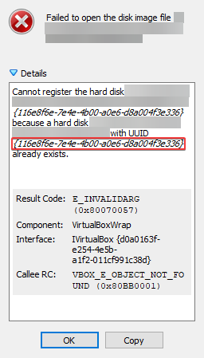

# Common Problems

## Unable to register hard disk \(UUID already exists\)

### Error Details

Cannot register the hard disk because a hard disk with UUID: { _uuid_  } already exists. 

| Result Code: | E\_INVALIDARG \(0x80070057\) |
| :--- | :--- |
| Component: | VirtualBoxWrap |
| Interface: | IVirtualBox {d0a0163f-e254-4e5b-a1f2-011cf991c38d} |
| Callee RC: | VBOX\_E\_OBJECT\_NOT\_FOUND \(0x80BB0001\) |



### Root Cause

Copy the UUID and run this command to get more information about this hard disk:

```text
$ cd "C:\Program Files\Oracle\VirtualBox"
```

```text
$ VBoxManage.exe showmediuminfo {116e8f6e-7e4e-4b00-a0e6-d8a004f3e336}

UUID:           116e8f6e-7e4e-4b00-a0e6-d8a004f3e336
Parent UUID:    base
State:          inaccessible
Access Error:   Could not open the medium 'C:\path\to\virtual-disk.vdi'.
VD: error VERR_FILE_NOT_FOUND opening image file 'C:\path\to\virtual-disk.vdi' (VERR_FILE_NOT_FOUND)
Type:           normal (base)
Location:       C:\path\to\virtual-disk.vdi
Storage format: VDI
[...]
In use by VMs:  ubuntu-desktop (UUID: 03f657a5-cb04-4784-b142-5419cb81607a)
```


`By executing this command, we found the root cause. It tells us the virtual disk is nowhere to be found.`


### Solution

Change the virtual disk's UUID by running this command:

```text
$ VBoxManage.exe internalcommands sethduuid 'C:\path\to\virtual-disk.vdi'

UUID changed to: bc7b467e-9c29-44b2-9561-c2c6655e8268
```

You should now be able to start the Virtual Machine if the virtual disk is still in the same directory. If it is not the case, just map the virtual hard drive to the right path and start the virtual machine.


